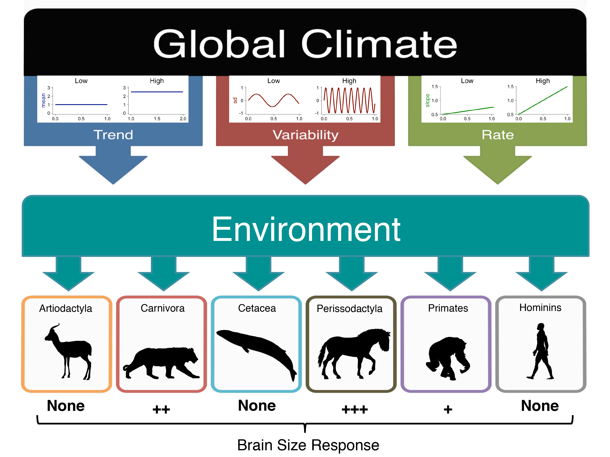

# Brain_Climate_Project
Investigation of whether changes in paleoclimate influenced brain size evolution across five mammalian taxonomic orders

  

## Title:  
Global climate influenced the evolutionary history of brain size increase in some mammalian lineages, but not in hominins

## Abstract:  
Increases in brain size over the course of evolutionary time have been observed in multiple mammalian lineages, including hominins. This has inspired a variety of competing proposals to explain the underlying forces driving brain size increase, among them large-scale changes in climate. However multiple aspects of the climate (e.g. trend, variability, and rate of change in temperature and/or aridity) may have simultaneously influenced brain evolution in hominins, and/or other taxa. Here we investigated the relationship between different measures of the global oxygen isotope record (trend, variability, and rate of change) and cranial capacity using a dataset of 222 fossil species representing five different mammalian taxonomic groups, while accounting for the potentially confounding effects of trendedness in these times-series datasets. While cranial capacity was correlated with some aspects of global climate in particular lineages (e.g. Carnivora, Perissodactyla), hominin brain size was shown to be unrelated to climatic forces. By using a statistical approach that can guard against false positive relationships to which time-series data are highly susceptible, we conclude that the results of this study do not support previous assertions that climatic shifts drove hominin brain evolution.
